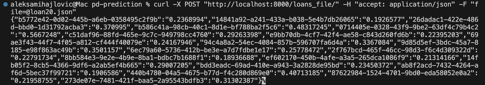

## Probability of Default Prediction


## What is the application about?

PD_prediction is a Dockerized application (Docker Hub: *maleckicoa/pd_pred*) that returns the probability of default for a given set of loans.
The application is based on a real world dataset from one large European fintech company (see: *dataset.csv*).


## How to run the application?

- Install and run the Docker application.
- Download the Docker image: `docker pull maleckicoa/pd_pred`
- Run the container: `docker run -d -p 8000:8000 maleckicoa/pd_pred`
- Make a curl POST request with loan data (see example **curl_file.txt**)<br/>
  `curl -X POST "http://localhost:8000/loans_file/" -H "accept: application/json" -F "file=@loan20.json"`
- Receive a JSON file with loan ids and probablities **{loan ID: Probability od default}**
- More examples of JSON files: **loan1.json**, **loan5.json**, **loan20.json**


## How does the application work?
   
FastAPI server receives loans information through curl POST requests which it then passes to the trained model object. 

The trained model object calculates the probabilites of default for the given loan information and returns back the default probabilites. 

The trained model object is a serialized (*mod.pkl* file) which can be re-trained - *PD_model.train.py*

The *PD_model_train.py* script is the core of the application, it holds 3 classes:
- **TrainValTest** class object splits the dataset into **train/val/test** subsets
- **WoeEncode** class object encodes the data subsets using **Weight of Evidence** encoding
- **Model class** object trains the **XG-boost classifier** and returns the probabilities od default


Loan features used to train the model:

```
    "uuid",
    "default",
    "account_amount_added_12_24m",
    "account_days_in_dc_12_24m",
    "account_days_in_rem_12_24m",
    "account_days_in_term_12_24m",
    "account_incoming_debt_vs_paid_0_24m",
    "account_status",
    "account_worst_status_0_3m",
    "account_worst_status_12_24m",
    "account_worst_status_3_6m",
    "account_worst_status_6_12m",
    "age",
    "avg_payment_span_0_12m",
    "avg_payment_span_0_3m",
    "merchant_category",
    "merchant_group",
    "has_paid",
    "max_paid_inv_0_12m",
    "max_paid_inv_0_24m",
    "name_in_email",
    "num_active_div_by_paid_inv_0_12m",
    "num_active_inv",
    "num_arch_dc_0_12m",
    "num_arch_dc_12_24m",
    "num_arch_ok_0_12m",
    "num_arch_ok_12_24m",
    "num_arch_rem_0_12m",
    "num_arch_written_off_0_12m",
    "num_arch_written_off_12_24m",
    "num_unpaid_bills",
    "status_last_archived_0_24m",
    "status_2nd_last_archived_0_24m",
    "status_3rd_last_archived_0_24m",
    "status_max_archived_0_6_months",
    "status_max_archived_0_12_months",
    "status_max_archived_0_24_months",
    "recovery_debt",
    "sum_capital_paid_account_0_12m",
    "sum_capital_paid_account_12_24m",
    "sum_paid_inv_0_12m",
    "time_hours",
    "worst_status_active_inv"
```


