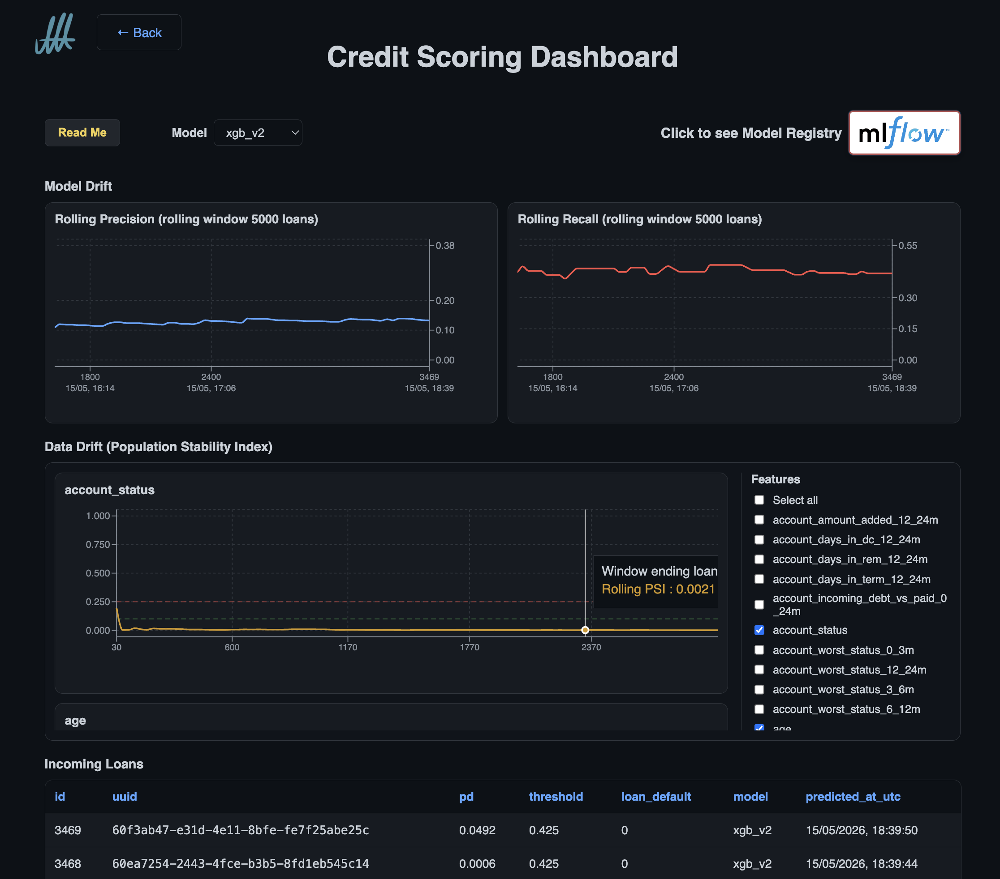

# Probability of Default (PD) prediction — credit risk scoring



## Table of contents

- [About the application](#about-the-application)
- [Live demo](#live-demo)
- [Repository layout](#repository-layout)
- [Prerequisites](#prerequisites)
- [How to run the Application:  Bash and Makefile](#how-to-run-the-application-bash-and-makefile)
- [How does the application work?](#how-does-the-application-work)
- [Ports and Compose profiles](#ports-and-compose-profiles)
- [ML Models applied](#ml-models-applied)
- [Model Registry](#model-registry)
- [Model Drift](#model-drift)
- [Data Drift (PSI)](#data-drift-psi)
- [Incoming Loans Table](#incoming-loans-table)
- [Feature definitions](#feature-definitions)

---

## About the application

**PD prediction** is a Dockerized stack that implements the backend of a credit-risk scoring workflow. The application allows to train credit models, register them in MLflow and to stream out-of-sample loans from the database to a default predict service. Finally, the application persists default probabilities together with rolling monitoring metrics back into the database.

For each scored loan, the application returns:

- Loan **Probability of Default (PD)**
- **Rolling Precision and Recall** calculated from predicted defaults and actual labels (rolling window: 5000 past out-of-sample loans)
- **Population Stability Index (PSI)** calculated from loan feature values  (rolling window: 5000 past out-of-sample loans)

The dataset is based on real-world loan data from a well-known European fintech company:

- ~80,000 loans in the **training** set
- ~9,000 loans in the **test** set

Only ~1.5% of loans are defaults, so the problem is **highly imbalanced** and challenging to score well.

Test loans are fetched every few seconds (configurable via `FETCH_INTERVAL_SECONDS` in `docker-compose.yml`) and scored by the loaded models.

---

## Live demo

Public UI: [PD Predict demo](https://maleckicoa.com/demo-apps/pd-predict)

---

## Repository layout

| Path | Role |
|------|------|
| `data-service/` | Builds a database from a Postgres image, populates the database with loans and stores all predictions and metrics|
| `fetch-service/` | Fetches out-of-sample loans and forwards them to the predict service |
| `predict-service/` | Receives new loans, passes them to serialized trained ML models and writes predictions to database |
| `train-service/` | Usef for training models (for LR, XGB, NN models) and storing serialized models into `models` folder  |
| `shared/` | Shared Python utilities (DB access, model types) used by fetch/predict/train services |
| `models/` | Trained model artifacts (mounted into predict/train containers) |
| `train-init/` | Enables the system to run on cold start (it ensures that at least 1 prediction model `lr1` exists) |
| `dev/` | Notebooks for EDA / modelling |
| `docker-compose.yml` | Brings together the database, model registry, train, train-init, predict and fetch service |
| `makefile` | Shortcuts for Compose (MLflow, Postgres, fetch, predict, train) — run from **this** directory |

---

## Prerequisites

Docker with Compose v2, and an `.env` file

**Env variables:**

- Custom for the user setup:
  - `POSTGRES_USER`
  - `POSTGRES_PASSWORD`
  - `POSTGRES_DB`

- You can start with these examples and placeholders:
  - `MODEL_NAMES=lr1,xgb1,xgb2`

  - `MODEL_PATH_LR1=/app/models/lr1_model.pkl`
  - `PREDICTION_THRESHOLD_LR1=0.84`

  - `MODEL_PATH_LR2=/app/models/lr2_model.pkl`
  - `PREDICTION_THRESHOLD_LR2=0.84`

  - `MODEL_PATH_XGB1=/app/models/xgb1_model.pkl`
  - `PREDICTION_THRESHOLD_XGB1=0.7204`

  - `MODEL_PATH_XGB2=/app/models/xgb2_model.pkl`
  - `MODEL_SCHEMA_PATH_XGB2=/app/predict-service/src/xgb2/xgb2_schema.json`
  - `PREDICTION_THRESHOLD_XGB2=0.4255`

  - `MODEL_PATH_NN1=/app/models/nn1_model.pkl`
  - `PREDICTION_THRESHOLD_NN1=0.85`

  - `MODEL_NAME=lr1`
  - `MODEL_PATH=/app/models/lr1_model.pkl`
  - `PREDICTION_THRESHOLD=0.84`


## How to run the Application:  Bash and Makefile

To run the application:

```bash
docker compose --profile fetch down -v --remove-orphans
docker compose --profile fetch up -d --build
```

 Commands above reveal the **`--profile fetch`**. The reason is existing dependency between some services. For example, commands below would perform a number of consecutive operations: Clean up existing data and volumes, build and initiate a database,  build and initiate **MLflow** service, run a one-shot **train-init** (cold-start LR model if needed), build and start the **predict** service , and finally build and start the **fetch** service.

Notes
- **`down -v`** deletes the named Docker volumes (Postgres + MLflow data). 
- Omit `-v` if you want to keep the database between runs.

Alternatively, the services could be triggered one-by-one using the commands from the `makefile` in this folder**

The train-service requires only the data-service and Mlflow to be running
Example:
```bash
make train-service-xgb2
```

---

## How does the application work?

The stack is composed of several **Docker services** working together:

1. **`postgres` (data-service image)** — Holds Postgres objects (tables/views)  with train and test loan data, scored outputs, and metrics like rolling precision/recall and PSI. Port **5434** on the host maps to Postgres inside the stack.
2. **`mlflow`** — Model registry and experiment tracking UI (**host port 5001**).
3. **`train-init`** — Runs once before predict: ensures a minimal **lr1** artifact exists when the `models/` volume is empty (see `train-init/ensure_lr1_model.sh`).
4. **`train` (profile `train`)** — Optional image used to run training scripts on demand (not part of the default fetch profile lifecycle).
5. **`fetch-service`** — Reads the next out-of-sample loan from Postgres and POSTs them to the predict service (`RUN_SERVICE_URL`, default `http://predict:8800/predict`).
6. **`predict-service`** — Loads models by refering to the `MODEL_NAMES` variables from the .env file. Then with loaded models it scores each loan and writes default probabilities to Postgres. The Recall, Precision and PSI metrics are performed using Views in Postgres, the predict-service doesn't run those.

---

## Ports and Compose profiles

| Host port | Service | Notes |
|-----------|---------|--------|
| **5434** | Postgres | Host port defined in the composer file |
| **5001** | MLflow | UI and API under `/mlflow` static prefix in Compose |
| **8800** | predict-service | FastAPI |

- **Profile `fetch`:** postgres, mlflow, train-init, predict, fetch (full live scoring loop).
- **Profile `train`:** training container runs (use **make** commands to train models).

After changing `docker-compose.yml` or `.env`, **recreate** containers that consume those variables (use **make** commands from the **makefile**) so new .env is picked up.

---

## ML Models applied

The **predict-service** can run several models in parallel. Models used in scoring today:

- **`lr_v1`** — simple logistic regression (`lr1` artifact).
- **`xgb_v1`** — gradient boosting (`xgb1` artifact).
- **`xgb_v2`** — extension of `xgb_v1` with a different preprocessing approach (binning + WoE) (`xgb2` artifact).

In development / not wired in predict-service yet:

- **`lr_v2`** — logistic regression with WoE encoding.
- **`nn_v1`** — feedforward neural network (128-128-64-1).

---

## Model Registry

MLflow is served on **host port 5001** (see `docker-compose.yml`).

There is currently no single “champion” model. Model runs are logged individually so you can compare parameters, metrics and artifacts

---

## Model Drift

In the data-service, see the Postgres view: **`test_defaults_roll_metrics`**.

Rolling precision and recall are computed on a rolling window of **5,000** loans.

Model thresholds are calibrated on the training dataset to maximize recall while maintaining precision **≥ 0.15**.

Because the dataset is very imbalanced, rolling metrics are **volatile at first**; as the window fills, they tend to stabilize toward values consistent with the training distribution.

After the ~9,000-loan test set is exhausted, the fetch loop **starts again from the beginning** of the test queue (continuous demo).

---

## Data Drift (PSI)

In the data-service, see the Postgres view: **`test_feat_roll_psi`**.

**Population Stability Index (PSI)** measures whether feature distributions shift over time relative to the training reference.

PSI is also computed on a rolling window of **5,000** loans. Common interpretation:

- PSI **< 0.10** → stable  
- PSI **< 0.25** → acceptable  
- PSI **≥ 0.25** → significant drift  

---

## Incoming Loans Table

In the data-service, see the Postgres table: **`test_defaults`**, it contains:

- Default probability (**PD**)
- **Threshold** applied to the PD
- **Actual** default label (0 = non-default, 1 = default)
- **Model** that produced the score
- **Timestamp** of the score


---

## Feature definitions

Loan features used to train the models:

- **account_amount_added_12_24m** — total amount added to the account during the last 12–24 months
- **account_days_in_dc_12_24m** — number of days the account was in debt collection during the last 12–24 months
- **account_days_in_rem_12_24m** — number of days in reminder status during the last 12–24 months
- **account_days_in_term_12_24m** — number of days under payment terms or installment arrangements during the last 12–24 months
- **account_incoming_debt_vs_paid_0_24m** — ratio of incoming debt to paid debt over the last 0–24 months
- **account_status** — current overall status of the borrower’s account
- **account_worst_status_0_3m** — worst account status observed during the last 0–3 months
- **account_worst_status_12_24m** — worst account status observed during the last 12–24 months
- **account_worst_status_3_6m** — worst account status observed during the last 3–6 months
- **account_worst_status_6_12m** — worst account status observed during the last 6–12 months
- **age** — age of the borrower
- **avg_payment_span_0_12m** — average time between invoice issuance and payment during the last 0–12 months
- **avg_payment_span_0_3m** — average time between invoice issuance and payment during the last 0–3 months
- **merchant_category** — category of the merchant associated with the transaction or loan
- **merchant_group** — broader merchant industry or business group classification
- **has_paid** — indicator showing whether the borrower has made any payments
- **max_paid_inv_0_12m** — maximum paid invoice amount during the last 0–12 months
- **max_paid_inv_0_24m** — maximum paid invoice amount during the last 0–24 months
- **name_in_email** — indicator showing whether the borrower’s name appears in the email address
- **num_active_div_by_paid_inv_0_12m** — ratio of active invoices to paid invoices during the last 0–12 months
- **num_active_inv** — number of currently active invoices
- **num_arch_dc_0_12m** — number of archived debt collection cases during the last 0–12 months
- **num_arch_dc_12_24m** — number of archived debt collection cases during the last 12–24 months
- **num_arch_ok_0_12m** — number of successfully closed or paid archived accounts during the last 0–12 months
- **num_arch_ok_12_24m** — number of successfully closed or paid archived accounts during the last 12–24 months
- **num_arch_rem_0_12m** — number of archived reminder cases during the last 0–12 months
- **num_arch_written_off_0_12m** — number of archived written-off accounts during the last 0–12 months
- **num_arch_written_off_12_24m** — number of archived written-off accounts during the last 12–24 months
- **num_unpaid_bills** — number of currently unpaid bills
- **status_last_archived_0_24m** — status of the most recently archived account during the last 0–24 months
- **status_2nd_last_archived_0_24m** — status of the second most recently archived account during the last 0–24 months
- **status_3rd_last_archived_0_24m** — status of the third most recently archived account during the last 0–24 months
- **status_max_archived_0_6_months** — worst archived account status during the last 0–6 months
- **status_max_archived_0_12_months** — worst archived account status during the last 0–12 months
- **status_max_archived_0_24_months** — worst archived account status during the last 0–24 months
- **recovery_debt** — amount of debt currently under recovery or collection process
- **sum_capital_paid_account_0_12m** — total capital repaid on the account during the last 0–12 months
- **sum_capital_paid_account_12_24m** — total capital repaid on the account during the last 12–24 months
- **sum_paid_inv_0_12m** — total amount of paid invoices during the last 0–12 months
- **time_hours** — hour of the day when the application or transaction occurred
- **worst_status_active_inv** — worst status among currently active invoices
